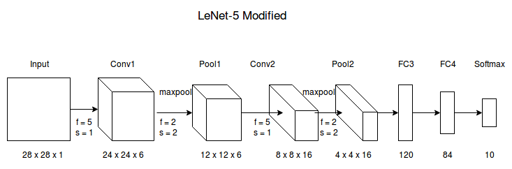

----------------
LeNet-5-Modified
----------------

Modified version of LeNet-5 to recognize handwritten digit

**Architecture**: `Convolutional Neural Network (Coursera) <https://www.coursera.org/learn/convolutional-neural-networks/lecture/uRYL1/cnn-example>`_

**Dataset**: `MNIST (Subset) <http://yann.lecun.com/exdb/mnist/>`_

------
Result
------

Here are the results (training) I got for different configurations

+--------+------------+---------------+---------+-----------+
| Epochs | Batch Size | Learning Rate |    Loss |  Accuracy |
+========+============+===============+=========+===========+
|      5 |        512 |        0.0001 |   0.313 |    90.947 |
+--------+------------+---------------+---------+-----------+
|      5 |        512 |        0.0005 |   0.811 |    76.036 |
+--------+------------+---------------+---------+-----------+
|      5 |        256 |        0.0001 |  0.6852 |    75.724 |
+--------+------------+---------------+---------+-----------+
|      5 |        256 |        0.0005 |  0.5342 |    87.793 |
+--------+------------+---------------+---------+-----------+
|      5 |        128 |        0.0001 |  0.4005 |    85.771 |
+--------+------------+---------------+---------+-----------+
|      5 |        128 |        0.0005 |  0.5240 |    78.402 |
+--------+------------+---------------+---------+-----------+
|      5 |         64 |        0.0001 |  0.7928 |    68.419 |
+--------+------------+---------------+---------+-----------+
|      5 |         64 |        0.0005 | 0.04527 | **98.62** |
+--------+------------+---------------+---------+-----------+

**Test Accuracy**

+--------+------------+---------------+---------+------------+
| Epochs | Batch Size | Learning Rate |    Loss |  Accuracy  |
+========+============+===============+=========+============+
|      5 |        512 |        0.0001 |   0.263 |    92.423  |
+--------+------------+---------------+---------+------------+
|      5 |        512 |        0.0005 |   0.794 |    76.387  |
+--------+------------+---------------+---------+------------+
|      5 |        256 |        0.0001 |  0.6551 |    76.181  |
+--------+------------+---------------+---------+------------+
|      5 |        256 |        0.0005 |  0.5298 |    87.690  |
+--------+------------+---------------+---------+------------+
|      5 |        128 |        0.0001 |  0.3781 |    86.167  |
+--------+------------+---------------+---------+------------+
|      5 |        128 |        0.0005 |  0.5240 |    79.066  |
+--------+------------+---------------+---------+------------+
|      5 |         64 |        0.0001 |  0.7707 |    68.970  |
+--------+------------+---------------+---------+------------+
|      5 |         64 |        0.0005 | 0.04527 | **98.377** |
+--------+------------+---------------+---------+------------+

-----
Usage
-----

**training**: python model.py --train true <MNIST-path> <model-save-path>

**training**: python model.py --test true <MNIST-path> <model-save-path>
